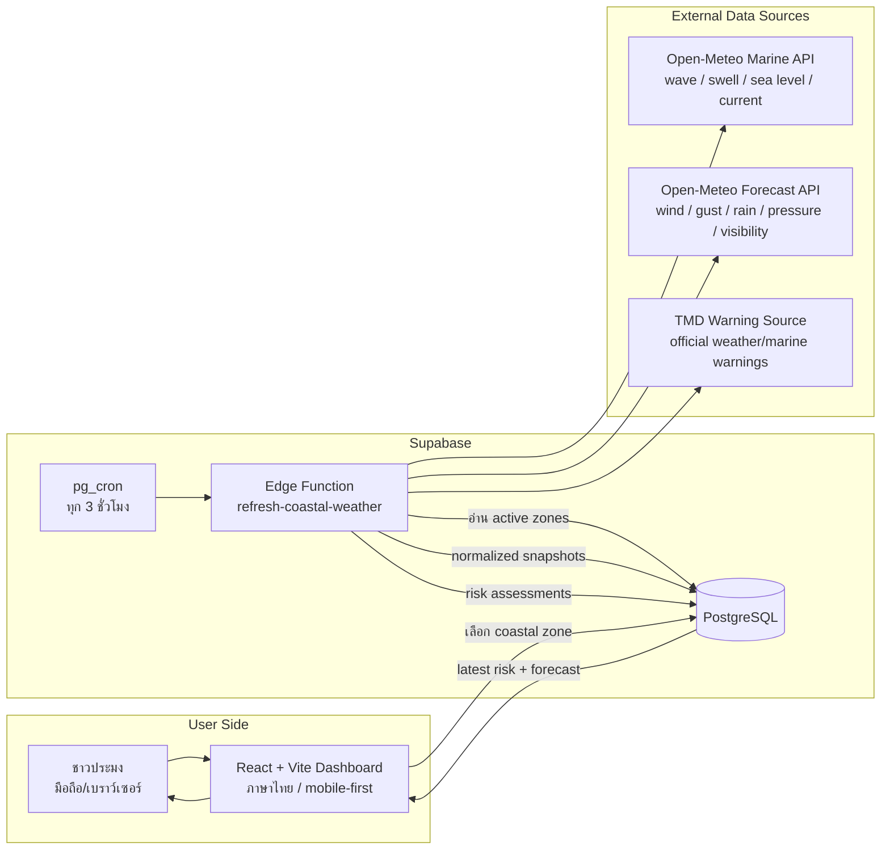
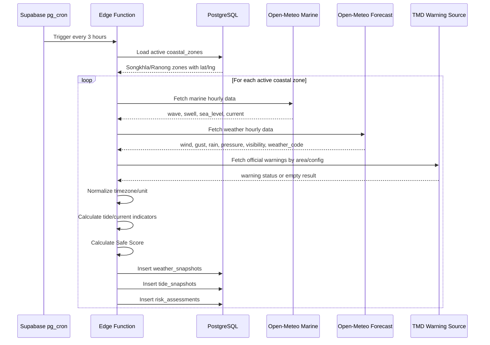
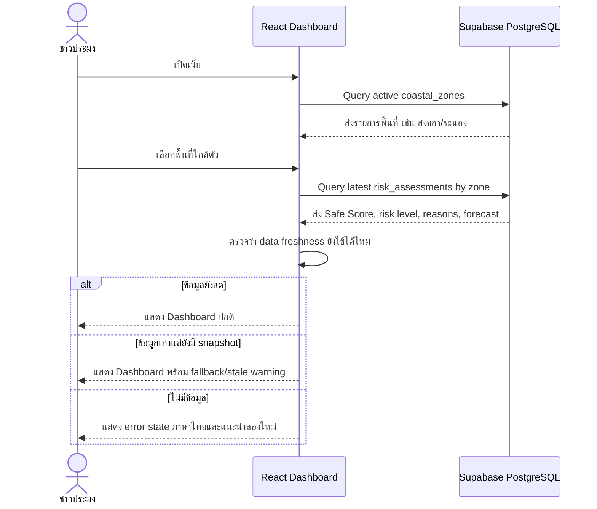

# 01 - Phase 1 Data Flow Diagram

ไฟล์นี้อธิบาย data flow หลักของ FishSence/FishSense Phase 1

## Design Decisions

- ผู้ใช้ไม่ต้องสมัครสมาชิกหรือ login
- ผู้ใช้เลือกพื้นที่จาก pilot coastal zones ที่ระบบเตรียมไว้ เช่น สงขลา/ระนอง
- ระบบดึงข้อมูลล่วงหน้าทุก 3 ชั่วโมงเฉพาะ active coastal zones
- Frontend อ่านผลล่าสุดจาก Supabase เพื่อให้ dashboard โหลดเร็ว
- ถ้า snapshot ล่าสุดเก่าเกินกำหนด ให้แสดง stale/fallback state
- TMD warning เป็นแหล่งคำเตือนทางการตั้งแต่ Phase 1 แต่เรียกผ่าน Edge Function เท่านั้น

## High-Level Data Flow



## Scheduled Refresh Flow



## Dashboard Read Flow



## Data Freshness Rule

ค่าแนะนำสำหรับ MVP:

- `fresh`: ข้อมูลอัปเดตไม่เกิน 3 ชั่วโมง 30 นาที
- `stale`: ข้อมูลเก่ากว่า 3 ชั่วโมง 30 นาที แต่ยังไม่เกิน 12 ชั่วโมง
- `unavailable`: ไม่มี snapshot หรือเก่ากว่า 12 ชั่วโมง

เหตุผล: cron refresh ทุก 3 ชั่วโมง จึงควรเผื่อ delay เล็กน้อย แต่ต้องไม่ทำให้ผู้ใช้เข้าใจว่าข้อมูลเก่าคือข้อมูลสด

## Frontend Data Contract

Frontend ควรอ่านข้อมูลที่พร้อมแสดงแล้ว ไม่ควรคำนวณ risk logic หลักเอง

```ts
type ZoneDashboardResult = {
  zone: {
    id: string
    name: string
    province: string
    lat: number
    lng: number
  }
  current: {
    assessedAt: string
    safeScore: number
    riskLevel: 'green' | 'yellow' | 'red'
    summaryTh: string
    reasonCodes: string[]
    hardStopFlags: string[]
    dataFreshness: 'fresh' | 'stale' | 'unavailable'
  }
  hourly48h: Array<{
    time: string
    safeScore: number
    riskLevel: 'green' | 'yellow' | 'red'
    waveHeightM: number | null
    windGustKmh: number | null
    precipitationMm: number | null
    tideStrength: 'weak' | 'normal' | 'strong' | null
  }>
  daily7d: Array<{
    date: string
    minScore: number
    worstRiskLevel: 'green' | 'yellow' | 'red'
    mainReasons: string[]
  }>
}
```

## Notes

- On-demand GPS/pin อิสระยังไม่ใช่ MVP แรก
- ถ้าจะเพิ่ม GPS ภายหลัง ให้ทำเป็น flow แยก เพราะเกี่ยวกับ privacy และ snapshot storage policy
- TMD endpoint/feed จริงควรเป็น config ใน `data_sources` หรือ `app_config` ไม่ hardcode ใน frontend

