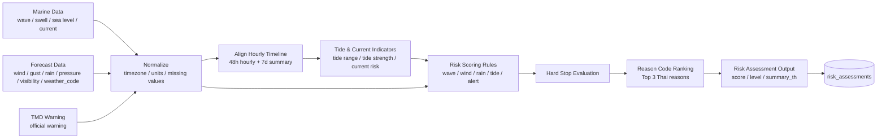
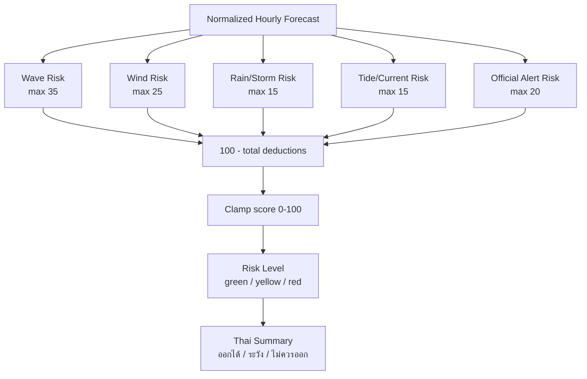
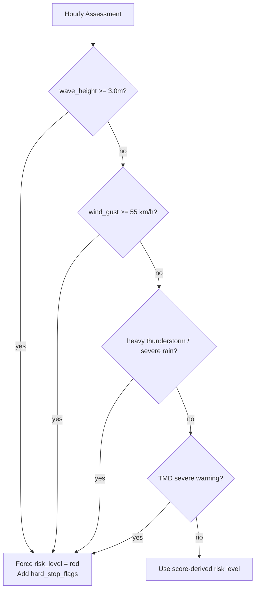
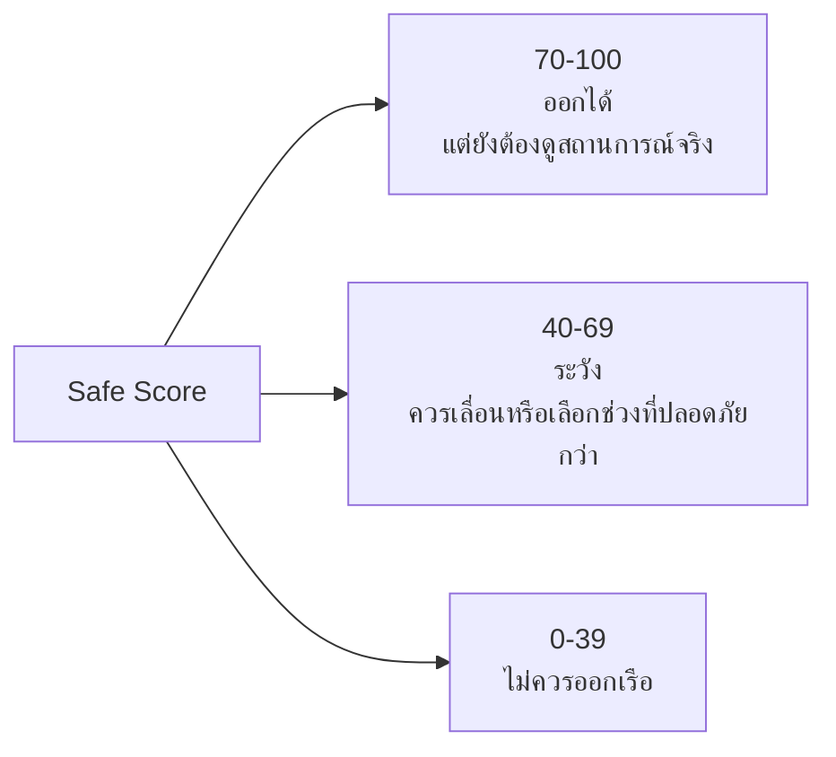
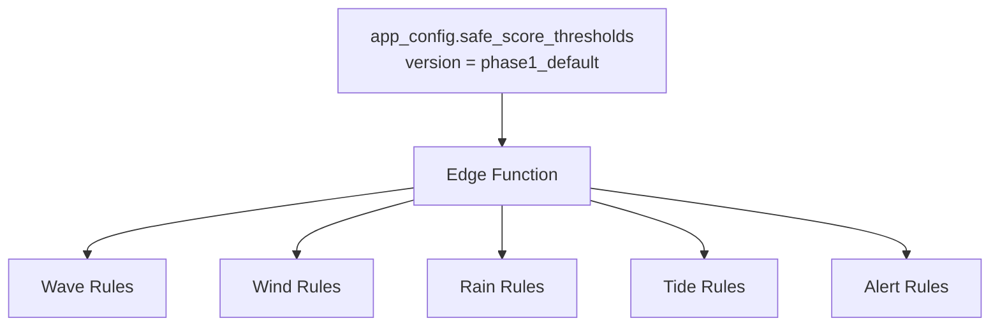

# 02 - Phase 1 Safe Score Pipeline

ไฟล์นี้อธิบาย pipeline การคำนวณ Safe Score ของ FishSence/FishSense Phase 1

## Design Decisions

- MVP แรกใช้ threshold ชุดเดียวสำหรับทุก pilot zone
- Safe Score เป็น rule-based
- คำนวณฝั่ง Supabase Edge Function ไม่ใช่ frontend
- ต้องเก็บ reason codes และ hard stop flags เพื่อ audit ย้อนหลัง
- TMD official warning มีผลต่อ risk level ตั้งแต่ Phase 1

## Pipeline Overview



## Risk Categories



## Hard Stop Rules

Hard stop คือเงื่อนไขที่บังคับให้แสดงระดับแดง แม้คะแนนรวมยังดูไม่ต่ำพอ



## Risk Level Mapping



## Reason Code Model

Reason codes ควรเป็น structured data เพื่อให้ frontend แสดงภาษาไทยได้ง่าย และ audit คะแนนย้อนหลังได้

```ts
type RiskReasonCode =
  | 'WAVE_HIGH'
  | 'SWELL_UNSTABLE'
  | 'WIND_GUST_STRONG'
  | 'WIND_SPEED_SUSTAINED'
  | 'RAIN_HEAVY'
  | 'VISIBILITY_LOW'
  | 'TIDE_STRONG'
  | 'CURRENT_STRONG'
  | 'TMD_WARNING'

type RiskReason = {
  code: RiskReasonCode
  severity: 'info' | 'warning' | 'danger'
  deduction: number
  metric: string
  value: number | string | null
  messageTh: string
}
```

ตัวอย่าง:

```json
[
  {
    "code": "WAVE_HIGH",
    "severity": "danger",
    "deduction": 25,
    "metric": "wave_height",
    "value": 2.4,
    "messageTh": "คลื่นสูง 2.4 เมตร"
  },
  {
    "code": "WIND_GUST_STRONG",
    "severity": "warning",
    "deduction": 18,
    "metric": "wind_gust",
    "value": 48,
    "messageTh": "ลมกระโชกแรง 48 กม./ชม."
  }
]
```

## Single Threshold MVP

ใช้ threshold ชุดเดียวก่อน เพื่อให้ Phase 1 ออกแบบง่ายและตรวจสอบได้



ในอนาคตค่อยเพิ่ม threshold แยกตาม:

- ประเภทเรือ
- ฝั่งอ่าวไทย/อันดามัน
- ฤดูกาลมรสุม
- zone-specific risk profile

## Output Shape

```ts
type RiskAssessment = {
  zoneId: string
  assessedAt: string
  validFor: string
  score: number
  level: 'green' | 'yellow' | 'red'
  summaryTh: string
  topReasons: RiskReason[]
  hardStopFlags: string[]
  recommendedWindowStart: string | null
  recommendedWindowEnd: string | null
  sourceSnapshotIds: {
    weatherSnapshotId: string
    tideSnapshotId: string | null
    tmdWarningId: string | null
  }
}
```

## Thai Summary Rules

ตัวอย่าง mapping เบื้องต้น:

- green: `ออกได้ แต่ควรตรวจสภาพอากาศจริงก่อนออกเรือ`
- yellow: `ควรระวังหรือเลือกช่วงเวลาที่ปลอดภัยกว่า`
- red: `ไม่ควรออกเรือในช่วงนี้`

ข้อความต้องสั้น ชัด และไม่สื่อว่าแอปเป็นประกาศทางการ

