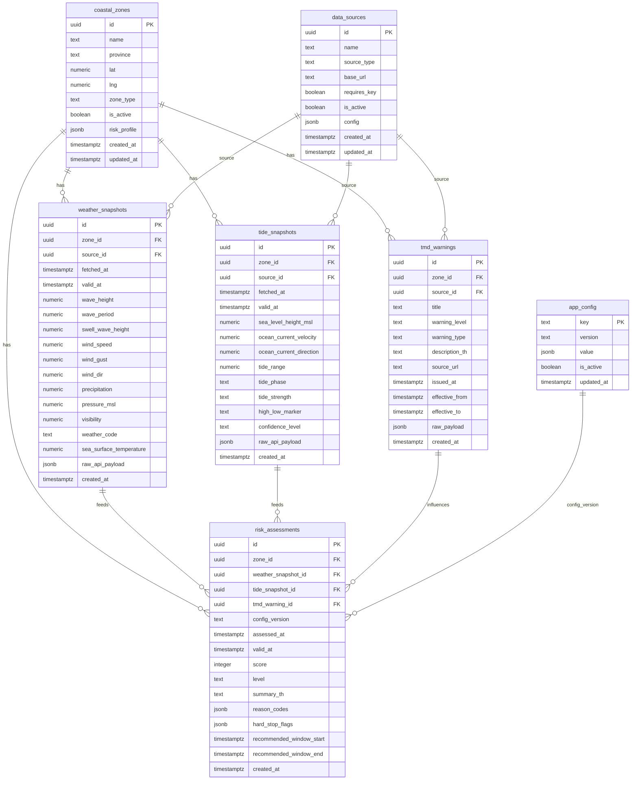

# 03 - Phase 1 Database ERD

ไฟล์นี้อธิบายโครงสร้างฐานข้อมูล Phase 1 สำหรับ FishSence/FishSense

## Design Decisions

- Phase 1 แรกยังไม่มีระบบสมัครสมาชิกหรือ login
- ฐานข้อมูลเน้นข้อมูล public/read-only สำหรับ dashboard
- ข้อมูลมาจาก scheduled refresh ทุก 3 ชั่วโมงสำหรับ active coastal zones
- Pilot zones เริ่มจากพื้นที่ตายตัว เช่น สงขลาและระนอง
- TMD warning ถูกเก็บเป็นข้อมูลประกอบของ risk assessment
- Threshold/config เก็บใน database เพื่อไม่ hardcode ใน frontend

## ERD



## Table Responsibilities

### `coastal_zones`

รายการพื้นที่ pilot ที่ผู้ใช้เลือกได้ เช่น สงขลา/ระนอง หรือท่าเรือ/พื้นที่ชายฝั่งย่อย

Phase 1 ไม่เปิดให้ผู้ใช้สร้าง zone เองใน MVP แรก

### `data_sources`

เก็บ metadata/config ของแหล่งข้อมูล เช่น:

- Open-Meteo Marine
- Open-Meteo Forecast
- TMD Warning

ใช้เพื่อให้ Edge Function รู้ว่า source ใด active และ endpoint/config ใดควรใช้

### `weather_snapshots`

เก็บข้อมูลอากาศ/คลื่นรายชั่วโมงที่ normalize แล้วจาก Open-Meteo

ควรเก็บ `raw_api_payload` เพื่อ audit หรือ debug แต่ frontend ไม่ควรอ่าน raw payload โดยตรง

### `tide_snapshots`

เก็บข้อมูล sea level, current และผลแปลงเชิงประกอบ เช่น tide strength

ข้อควรจำ: เป็นข้อมูลประกอบการตัดสินใจ ไม่ใช่ข้อมูลนำร่องเดินเรือ

### `tmd_warnings`

เก็บคำเตือนจาก TMD ที่ map เข้ากับ coastal zone

ถ้า TMD endpoint/feed เปลี่ยน ให้แก้ฝั่ง Edge Function/config ไม่แก้ frontend

### `risk_assessments`

ผลประเมินที่ frontend ใช้แสดง dashboard

ควรเป็นข้อมูลพร้อมใช้งาน:

- score
- level
- summary_th
- reason_codes
- hard_stop_flags
- valid_at

### `app_config`

เก็บ config ที่ควรปรับได้โดยไม่ต้อง deploy frontend เช่น:

- Safe Score threshold ชุดเดียวของ MVP
- data freshness rule
- TMD warning mapping
- active province/zone config

## Indexes

ควรมี index อย่างน้อย:

```sql
create index idx_coastal_zones_active on coastal_zones (is_active, province);
create index idx_weather_snapshots_zone_valid on weather_snapshots (zone_id, valid_at desc);
create index idx_tide_snapshots_zone_valid on tide_snapshots (zone_id, valid_at desc);
create index idx_tmd_warnings_zone_effective on tmd_warnings (zone_id, effective_from desc, effective_to desc);
create index idx_risk_assessments_zone_valid on risk_assessments (zone_id, valid_at desc);
```

## Public Read Policy

เพราะ Phase 1 แรกไม่มี login:

- `coastal_zones` อ่าน public ได้
- `risk_assessments` อ่าน public ได้
- `weather_snapshots` และ `tide_snapshots` อาจอ่าน public เฉพาะ normalized fields หรือให้ frontend อ่านผ่าน view
- `data_sources`, `app_config`, `raw_api_payload` ไม่ควรเปิด public ทั้งหมด
- insert/update/delete ทำได้เฉพาะ Edge Function service role

## Suggested Public View

เพื่อให้ frontend อ่านง่ายและปลอดภัย ควรทำ view เช่น:

```sql
create view public_zone_latest_risk as
select
  z.id as zone_id,
  z.name as zone_name,
  z.province,
  z.lat,
  z.lng,
  r.assessed_at,
  r.valid_at,
  r.score,
  r.level,
  r.summary_th,
  r.reason_codes,
  r.hard_stop_flags
from coastal_zones z
join lateral (
  select *
  from risk_assessments r
  where r.zone_id = z.id
  order by r.valid_at desc
  limit 1
) r on true
where z.is_active = true;
```

หมายเหตุ: SQL นี้เป็น sketch สำหรับ design ยังไม่ใช่ migration สุดท้าย

## Retention

ค่าเริ่มต้นที่แนะนำ:

- เก็บ hourly snapshots 30-90 วันสำหรับ MVP
- เก็บ risk assessments 90 วันขึ้นไปถ้าต้องใช้ audit
- raw payload อาจเก็บสั้นกว่า normalized data เพื่อลด storage

