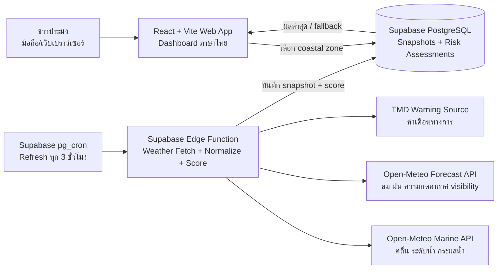
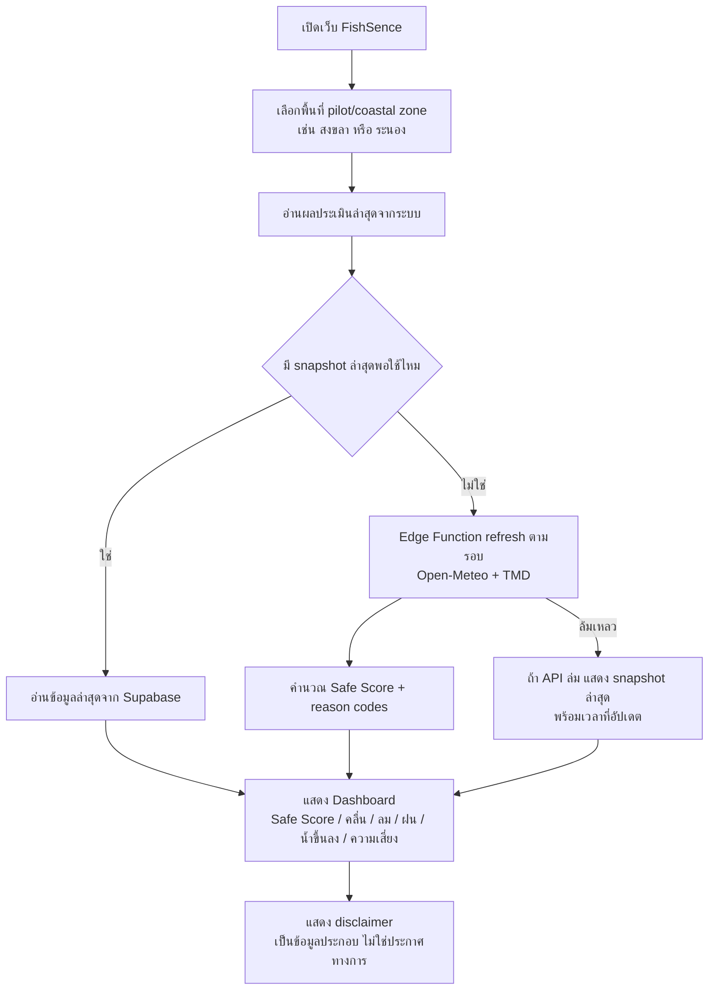
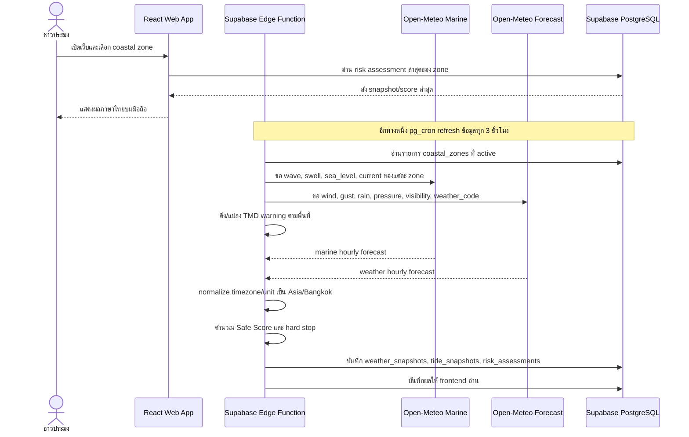

# Phase 1 System Overview Diagram

เอกสารนี้เป็นภาพรวมการทำงานของระบบ FishSence/FishSense Phase 1 ก่อนลงรายละเอียดใน `Docs/`

บริบทหลักอ้างอิงจาก private local knowledge base โดยอ่าน `meta/index.md` ก่อน แล้วใช้หน้า FishSense SRS v1.1 และ FishSense entity เป็นหลัก

## ขอบเขต Phase 1

Phase 1 คือระบบเว็บแอป React + Supabase สำหรับให้ชาวประมงดูสภาพอากาศทะเล น้ำขึ้นลง กระแสน้ำ และระดับความเสี่ยงก่อนออกเรือตามพิกัดหรือพื้นที่ชายฝั่งที่อยู่

ยังไม่ต้องมีระบบสมัครสมาชิกหรือ login ใน Phase 1 แรก ผู้ใช้ควรเปิดเว็บ เลือกพื้นที่ pilot เช่น สงขลา/ระนอง หรือ coastal zone ใกล้ตัว แล้วดูผลได้ทันที

## Diagram Reading Order

อ่าน diagram ตามลำดับนี้:

1. `01-phase1-data-flow.md` - การไหลของข้อมูลตั้งแต่ cron/API จนถึง dashboard
2. `02-safe-score-pipeline.md` - pipeline การคำนวณ Safe Score, hard stop และ reason codes
3. `03-database-erd.md` - โครงสร้างฐานข้อมูล Phase 1

## Locked Design Decisions

- Pilot area เป็นพื้นที่ตายตัวก่อน เช่น สงขลาและระนอง
- ผู้ใช้เลือกบริเวณจาก `coastal_zones` ที่ระบบเตรียมไว้
- ระบบดึงข้อมูลล่วงหน้าทุก 3 ชั่วโมงเฉพาะ coastal zones ที่กำหนด
- MVP แรกใช้ Safe Score threshold ชุดเดียว
- ดึงคำเตือนทางการจาก TMD ตั้งแต่ Phase 1 ผ่าน Edge Function
- ยังไม่ต้องมีสมัครสมาชิก/login ใน Phase 1 แรก

## System Context

## User Flow

## Data Processing Flow

## Main Components

```mermaid
flowchart TB
  subgraph Frontend[Frontend: React + Vite + TypeScript]
    location[Location Selector<br/>GPS / coastal zone]
    dashboard[Risk Dashboard]
    hourly[48h Hourly Forecast]
    daily[7d Daily Summary]
    states[Loading / Error / Fallback States]
  end

  subgraph Supabase[Supabase]
    fn[Edge Function]
    pg[(PostgreSQL)]
    schedule[pg_cron]
  end

  subgraph Domain[Domain Logic]
    normalize[Normalize API Response]
    tide[Tide/Current Analysis]
    risk[Safe Score Engine]
    reason[Thai Reason Codes]
  end

  location --> fn
  fn --> normalize
  normalize --> tide
  tide --> risk
  risk --> reason
  reason --> pg
  pg --> dashboard
  pg --> hourly
  pg --> daily
  pg --> states
  schedule --> fn
```

## Phase 1 Design Principles

- ผู้ใช้ไม่ต้องสมัครสมาชิกเพื่อดูผล Phase 1
- หน้าแรกต้องตอบคำถาม go/no-go ให้เร็วที่สุด
- เลือกจาก pilot coastal zones ที่เตรียมไว้ก่อน ไม่เปิดให้ปักหมุดอิสระใน MVP แรก
- Refresh ล่วงหน้าทุก 3 ชั่วโมงตาม coastal zones ที่กำหนด
- ข้อมูลหลักคือคลื่น ลม ฝน น้ำขึ้นลง กระแสน้ำ และคำเตือนที่เกี่ยวข้อง
- Safe Score ต้องเป็น rule-based และอธิบายเหตุผลภาษาไทยได้
- Tide/current เป็นข้อมูลประกอบ ไม่ใช่ข้อมูลนำร่องเดินเรือ
- API key และการเรียก API ภายนอกต้องอยู่ฝั่ง Supabase Edge Function
- ถ้า API ล่ม ต้อง fallback เป็น snapshot ล่าสุดและบอกเวลาข้อมูล
- UI ต้อง mobile-first และเหมาะกับชาวประมงที่ต้องการคำตอบเร็ว
